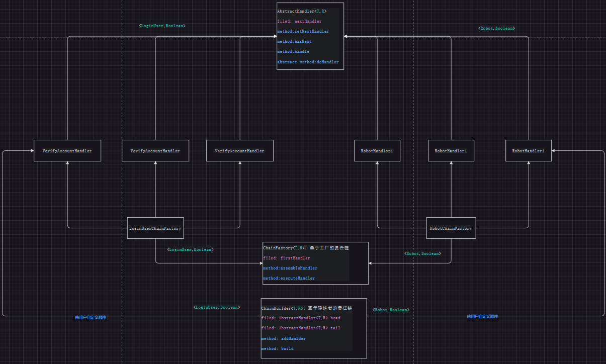

# designPartens-practice

## 三大工厂模式	
适用场景：
- Spring工厂

## 策略模式
适用场景：
- 可插拔式服务

## 委派模式	
适用场景：

## 模板方法模式
适用场景：
- 适用于框架的骨架设计

## 观察者模式
适用场景：
- 应用场景与MQ类似

## 单例模式
适用场景：
- 适用于Spring的单例Bean原理

## 原型模式	
适用场景：

## 代理模式
适用场景：
- jdk动态代理
- 适用于feign客户端代理原理
- 使用于mybatis之mapper代理原理

静态代理实现方式：
- [static_proxy](src%2Fmain%2Fjava%2Forg%2Flyflexi%2Fproxy%2Fstatic_proxy)

动态代理实现方式：
- [dynamic_proxy_jdk_v1](src/main/java/org/lyflexi/proxy/dynamic_proxy_jdk_v1)
- [dynamic_proxy_jdk_v2](src/main/java/org/lyflexi/proxy/dynamic_proxy_jdk_v2)
- [dynamic_proxy_jdk_v3](src/main/java/org/lyflexi/proxy/dynamic_proxy_jdk_v3)

cglib代理实现方式：
- [dynamic_proxy_cglib](src%2Fmain%2Fjava%2Forg%2Flyflexi%2Fproxy%2Fdynamic_proxy_cglib)
```xml
<dependency>
    <groupId>cglib</groupId>
    <artifactId>cglib</artifactId>
    <version>${cglib.version}</version>
</dependency>
```
从 JDK 1.8 升级到 JDK 17 之后，cglib报异常：
```shell
Caused by: net.sf.cglib.core.CodeGenerationException: 
java.lang.reflect.InaccessibleObjectException-->Unable to make protected final java.lang.Class java.lang.ClassLoader.defineClass(java.lang.String,byte[],int,int,java.security.ProtectionDomain) throws java.lang.ClassFormatError accessible: module java.base does not "opens java.lang" to unnamed module @4361bd48
```
解决方案： 在 java 命令后添加额外的参数 --add-opens java.base/java.lang=ALL-UNNAMED

cglib注意小心使用!

// 我们可能会习惯了在jdk动态代理的h.invoke方法中,执行method.invoke(target, args);target是传入h内部的目标对象

// 但是注意在cglib的intercept方法签名处,第一个参数是proxy – "this", the enhanced object, 是代理对象即this

// 因此下面这种给method.invoke(proxy, args);传入this将会出现死循环调用
```java
try {
    //原方法执行方式invokeSuper:
    Object invokeValue1 = methodProxy.invokeSuper(proxy, args);//执行被代理方法
    System.out.println("原方法执行方式1:methodProxy.invokeSuper(target, args);的结果："+invokeValue1);


    // 我们可能会习惯了在jdk动态代理的h.invoke方法中,执行method.invoke(target, args);,其中target是传入h内部的目标对象
    // 但是注意在cglib的intercept方法签名处,第一个参数是proxy – "this", the enhanced object, 是代理对象即this
    // 因此下面这种给method.invoke(proxy, args);传入this将一定会出现死循环调用
//            method.setAccessible(true);
//            Object invokeValue2 = method.invoke(proxy, args);
//            System.out.println("原方法执行方式2:method.invoke(target, args);的结果："+invokeValue2);

} catch (Throwable e) {
    throw new RuntimeException(e);
}
```


## 装饰者模式	
适用场景：
- 方法增强

## 适配器模式
适用场景：
- 类似于重载方法

## 建造者模式
适用场景：
- builder工厂

## 责任链模式
适用场景：
- 适用于AOP链式执行
- 适用于Mybatis的二级缓存

实现方式：
- 基于工厂的责任链
- 基于建造者的责任链
- 基于泛型和工厂的责任链，将数据对象和工厂都定义为泛型，使得责任链更加通用，
- 基于泛型和建造者的责任链，将数据对象和建造器都定义为泛型，使得责任链更加通用

最终的设计图如下：


## 享元模式	
适用场景：
- jdk Integer/Long数据池
- 自定义数据库连接池：数组/集合对象
- springioc容器：Map集合

## 组合模式	
适用场景：

## 门面模式：
适用场景：
- 封装内部的调用细节
- 业务二次封装缓存组件
- 业务二次封装消息组件

门面模式除了符合最小知识集原理之外，

门面模式还可以增强程序的安全性，比如在Java中，如果你有一个Father类和它的两个子类Son1和Son2，并且你有一个方法接受一个类型为Father的参数，那么你可以尝试将这个参数向下转型（downcast）为具体的Son1或Son2。例如：

在这两个具体类Son1/Son2中我们定义了许多内部的方法，原理上他可以进行强制转换之后调用，但这样不安全，除了接口Father中的公开方法之外，还暴露了Son1和Son2内部的隐私方法

注意要使用instanceof关键字检查传入的对象是否实际上是Son1或Son2的实例。这样做是为了避免ClassCastException，因为如果直接进行强制类型转换而不进行这种检查，且传入的对象不是目标类型的实例时，就会抛出这个异常。
```java
public void someMethod(Father father) {
    if (father instanceof Son1) {
        Son1 s1 = (Son1) father;
        // 现在可以使用s1作为Son1对象
    } else if (father instanceof Son2) {
        Son2 s2 = (Son2) father;
        // 现在可以使用s2作为Son2对象
    }
}
```

门面模式针对上述接口类型Father向下转型的情况（强制类型转换），增强了接口安全性, 详见[facadePattern](src%2Fmain%2Fjava%2Forg%2Flyflexi%2FfacadePattern)

## 桥接模式	
适用场景：

## 中介者模式	
适用场景：

## 迭代器模式	
适用场景：
- 如iterator

## 状态模式	
适用场景：
- spring-statemachine

## 解释器模式	
适用场景：

## 备忘录模式	
适用场景：

## 命令模式	
适用场景：

## 访问者模式	
